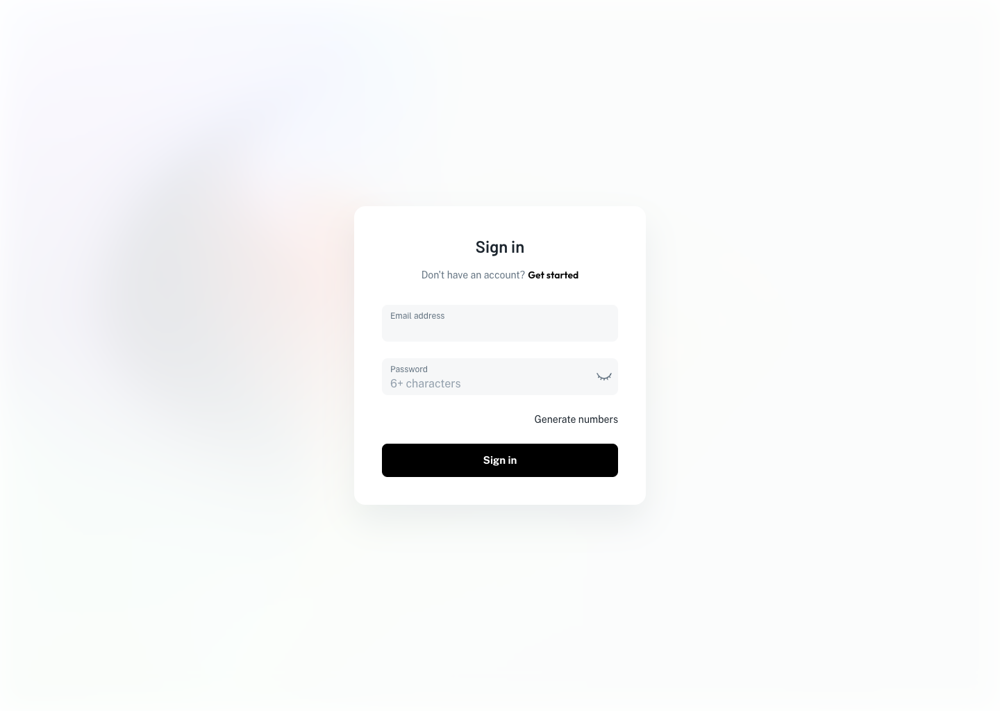
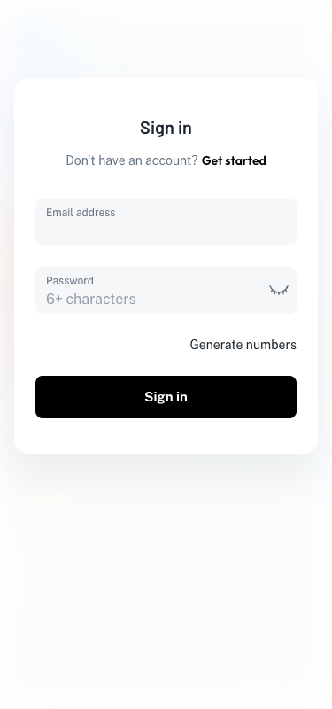
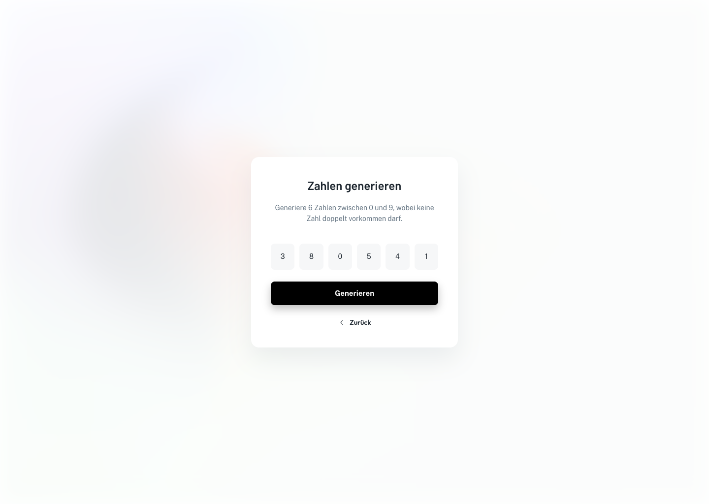
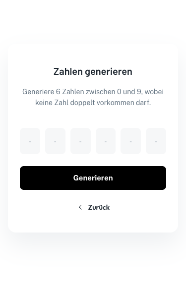

# TJ Labs – Trial Task (Next.js)

Two screens from the Figma file **"NextJs Aufgabe"** rebuilt 1:1 in Next.js and TypeScript, each in a desktop and a mobile version:

| Screen | Route | Figma frames |
| --- | --- | --- |
| Sign In | `/` | `SignIn_Centered` (1440 × 1024), `[MOBILE] SignIn_Centered` (375 × 800) |
| Number generator | `/number-generator` | `Zahlengenerator` (1440 × 1024), `[MOBILE] Verify` (375 × 589) |

The number generator is the only screen with logic. Clicking **Generieren** fills the six boxes with six unique random digits from 0 to 9.

| Desktop | Mobile |
| --- | --- |
|  |  |
|  |  |

---

## Contents

1. [Setup](#1-setup)
2. [Project structure](#2-project-structure)
3. [Design implementation](#3-design-implementation)
4. [Number generator](#4-number-generator)
5. [Own ideas (additions)](#5-own-ideas-additions)
6. [Decisions: libraries used and avoided](#6-decisions-libraries-used-and-avoided)
7. [Use of AI](#7-use-of-ai)
8. [Open points](#8-open-points)

---

## 1. Setup

**Requirements:** Node.js ≥ 20.9 and npm. Google Chrome is only needed for the browser tests.

```bash
npm install
npm run dev            # http://localhost:3000
```

| Command | What it does |
| --- | --- |
| `npm run dev` | Development server with hot reload |
| `npm run build` / `npm start` | Production build and server |
| `npm run lint` | ESLint (Next.js config) |
| `npm run typecheck` | TypeScript without emitting files |
| `npm test` | Unit and component tests (Vitest) |
| `npm run test:e2e` | Browser tests: layout against Figma, colours, generator, navigation (Playwright) |

`npm run test:e2e` builds the app and starts it on port 3123. By default it uses the locally installed Google Chrome, so nothing has to be downloaded. To use Playwright's own browser instead, run `npx playwright install chromium` once, then `PLAYWRIGHT_CHANNEL=chromium npm run test:e2e`.

---

## 2. Project structure

```
src/
├── app/                                  Next.js App Router
│   ├── layout.tsx                        Root layout: fonts (next/font), metadata, viewport
│   ├── globals.css                       Design tokens (CSS variables) + reset + breakpoint
│   ├── page.tsx / page.module.css        Route "/"                 → Sign In screen
│   └── number-generator/                 Route "/number-generator" → Number generator screen
│       ├── page.tsx
│       └── page.module.css
├── components/                           Shared by both screens, no business logic
│   ├── AuthLayout/                       Page shell: background, header, centred content
│   ├── Background/                       Blurred photo + 90 % white overlay
│   ├── Header/                           Empty top bar (keeps the Figma height and spacing)
│   ├── Card/                             White card (radius 16, shadow)
│   ├── Heading/                          Page title (h4 style, responsive)
│   ├── Button/                           Black primary button (Contained / Primary / L)
│   ├── IconButton/                       40 × 40 round button (eye)
│   ├── TextField/                        Filled text field (label + input + end adornment)
│   ├── PasswordField/                    TextField + eye button (client component)
│   ├── Flag/                             Flag image (next/image)
│   └── icons/icons.tsx                   SVG icons exported from the Figma vectors
├── features/                             Screen-specific composition
│   ├── sign-in/SignInForm.tsx            Sign In card
│   └── number-generator/
│       ├── NumberGenerator.tsx           Card + state (client component)
│       ├── DigitBoxes.tsx                The six boxes (empty / filled)
│       └── NumberGenerator.test.tsx      Component test
└── lib/
    ├── generate-unique-digits.ts         Generator logic, framework-free
    └── generate-unique-digits.test.ts    Unit tests incl. exhaustive uniformity proof

e2e/figma-layout.spec.ts                  Playwright: 38 element boxes compared with Figma
tools/fig-inspect/                        Script that reads the .fig file (how the values were taken)
docs/screenshots/                         Screenshots used in this README
public/images/                            Background photo from the Figma file
AGENTS.md, CLAUDE.md                      Generated by create-next-app, notes for AI coding agents
```

**How the layers depend on each other:** `app/` (routes) → `features/` (screens) → `components/` (building blocks) → `app/globals.css` (tokens). `lib/` has no React or Next.js imports at all, so the generator can be tested and reused on its own.

---

## 3. Design implementation

### 3.1 How the values were taken from Figma

The export zip contains the whole Figma file as `canvas.fig` plus the image assets. I did not measure anything by eye or estimate values from screenshots. Instead I read the file itself:

1. A `.fig` file is a binary [Kiwi](https://github.com/evanw/kiwi) message. `tools/fig-inspect/inspect.mjs` decompresses it, decodes the schema and the document, and prints every layer of a frame with its **exact** size, position, auto-layout settings (direction, gap, padding, alignment), fills, strokes, corner radii, effects, fonts and texts.
2. Components (`INSTANCE`) only reference their main component in the file. The script expands them and applies the instance overrides (texts, visibility, swapped icons, auto-layout results). The result is what Figma actually draws on the canvas.
3. **Design variables are resolved to their values.** The file uses variable collections (`Theme` Light/Dark, `[Core] Typography` Desktop/Mobile, spacing, radius). The mobile frames switch the typography collection to its *Mobile* mode. That mode is the only reason the heading is 20/30 px on mobile and 24/36 px on desktop.
4. Icons: the vector geometry of the four icons is stored as path commands in the file. The script converts them into SVG path strings (`--icon`).

```bash
cd tools/fig-inspect && npm install
node inspect.mjs "/path/to/canvas.fig" --list                 # pages and frames with IDs
node inspect.mjs "/path/to/canvas.fig" 63:26215               # SignIn_Centered (desktop)
node inspect.mjs "/path/to/canvas.fig" 63:26202 --mobile      # [MOBILE] SignIn_Centered
node inspect.mjs "/path/to/canvas.fig" --icon "icons/solid/ic-solar:eye-closed-outline"
```

Example output line (the card of the number generator):

```
INSTANCE<Auth/Form/Verify> 420×387 at 510,318.5 fill [#ffffff {background/default}] radius 16/16/16/16
  shadow 0 24 48 0 #919eab @0.16  auto-layout vertical gap 24 padding 40/40/40/40 align MIN/CENTER
```

The same values can be checked by hand in Figma's Dev Mode after importing the zip. The script only makes the work exact and repeatable.

### 3.2 Design tokens

All colours, radii and shadows live as CSS custom properties in [`src/app/globals.css`](src/app/globals.css). They are named after the Figma variables (`--text-secondary` ↔ `text/secondary`), so a value can be traced back to Figma with one search.

| Token | Value | Used for |
| --- | --- | --- |
| `--text-primary` | `#1C252E` | Headings, input text, links, digits |
| `--text-secondary` | `#637381` | Subline, description, field labels |
| `--text-disabled` | `#919EAB` | Placeholder "6+ characters", empty digit "-" |
| `--primary-main` | `#000000` | Button, "Get started" |
| `--grey-8` | `rgba(145,158,171,.08)` | Text field and digit box background |
| `--card-shadow` | `0 24px 48px rgba(145,158,171,.16)` | Card |
| Radius | card 16, field/box/button 8, icon button 50 % | |

**Typography** (all line heights in px, letter spacing 0):

| Element | Font | Size / line height |
| --- | --- | --- |
| Heading ("Sign in", "Zahlen generieren") | Barlow SemiBold (600) | 24/36 desktop, 20/30 mobile |
| Body (subline, description, "Generate numbers", digits) | Public Sans Regular | 14/22 |
| Field label | Public Sans Regular | 12 (in an 18 px row) |
| Field value / placeholder | Public Sans Regular | 16/24 |
| Button | Public Sans Bold (700) | 15/26 |
| "Get started", "Zurück" | Outfit SemiBold (600) | 14/22 |

### 3.3 Background

The Figma component `background/overlay-1` has two layers: a photo (fill mode *Fill*) with a **40 px layer blur**, covered by a white rectangle at **90 % opacity**. It is rebuilt the same way in [`Background`](src/components/Background):

- The photo is a CSS `background-size: cover` centred, like Figma's *Fill* mode. I copied it from the zip and scaled it from 4000 px to 2000 px wide (98 KB). After a 40 px blur the extra resolution is invisible.
- Figma's layer blur value is twice the CSS blur radius, so *blur 40* becomes `filter: blur(20px)`. Like in Figma, the blurred edges fade into the white page and the page clips the overflow.
- The overlay is a separate `div` with `opacity: 0.9`, just like the Figma layer.

I blur live instead of using a pre-blurred image. That keeps the structure identical to Figma and lets the blur adapt to any viewport size.

### 3.4 Fonts

The three fonts are loaded with `next/font/google` in [`layout.tsx`](src/app/layout.tsx). Next.js downloads them at build time and serves them from the app itself: no request to Google, no layout shift, and a size-adjusted fallback font. Only the weights used in Figma are loaded: Barlow 600, Public Sans 400/700 and Outfit 600. `-webkit-font-smoothing: antialiased` is set because it matches how Figma renders text on macOS.

### 3.5 Icons and images

- **Icons** (eye closed, eye open, arrow left) come from the Solar set used in the file. The SVG paths were **exported from the Figma vectors** (see 3.1), including their offset inside the 24 × 24 frame. Each icon is a small React component with `fill="currentColor"`, so its colour comes from CSS: `action/active` for the eye, `text/primary` for the arrow. The arrow is rendered at 16 px, like in Figma.
- **Flags and settings:** the Figma header has a language flag on both screens and a settings button on the generator. None of them had a function, so they were left out and the header is empty. It still keeps its Figma height and padding, so the card position is unchanged.

### 3.6 Desktop and mobile layout

Figma has exactly two sizes: 1440 px and 375 px. I use **one breakpoint at 600 px**, which is the `sm` breakpoint of the MUI-based kit the file was built with. The desktop card needs 420 px + 2 × 16 px gutter = 452 px, so from 600 px on it fits with room to spare. Below 600 px the mobile frames apply. All differences are expressed as token overrides (`--header-height`, `--card-padding-x`, `--h4-size` …) or as a few local media queries.

| | Desktop (≥ 600 px) | Mobile (< 600 px) |
| --- | --- | --- |
| Header | 72 px high, 24 px side padding, **absolutely positioned** on top of the page | 64 px high, 16 px side padding, part of the normal flow |
| Card position | Centred horizontally **and** vertically in the viewport | 24 px below the header, 16 px side gutters, 120 px bottom padding |
| Card | 420 px wide, 40 px padding | Full width (343 px at 375), 40 px top/bottom, 24 px left/right |
| Heading | 24/36 | 20/30 |
| Generator background | Blurred photo | Plain white (as in the `[MOBILE] Verify` frame) |

Inside the card, the Figma auto layouts map directly to flexbox (`gap`, `padding`, `align-items`). On desktop, `main` has the same padding at the top and bottom (`header height + 24 px`). The card therefore stays exactly centred, as in Figma, but can never slide under the header on short screens like 1366 × 768.

Checked sizes: 320 × 568, 375 × 800, 768 × 1024, 1366 × 768, 1440 × 1024 and 1920 × 1080, with no horizontal scrolling at any of them.

### 3.7 Reused components

Both screens are built from the same parts, just as they share components in Figma:

- `AuthLayout` = `Background` + `Header` + centred `main`. It is used by both routes.
- `Card`, `Heading`, `Button`, `IconButton` are shared by both cards.
- `TextField` renders both fields; `PasswordField` adds the eye button to it.
- The digit boxes use the same `grey-8` background and 8 px radius as the text fields, via the same tokens.

### 3.8 Comparing the result with Figma

1. **Automated layout check** – [`e2e/figma-layout.spec.ts`](e2e/figma-layout.spec.ts) opens every screen at the exact Figma frame size and measures **32 elements** (card, heading, fields, buttons, digit boxes, icon buttons …). Each box's x, y, width and height is compared with the absolute position of the matching Figma layer, as read by the script. Layout boxes must match within **1 px**; text-sized boxes within 2.5 px, because the browser rasterises fonts slightly differently from Figma. A second test checks the computed colours, shadow and radius.
2. **Screenshots** at the frame sizes (`docs/screenshots/`), compared side by side with the frames in Figma.
3. **Manual check** of hover and focus states and of the in-between sizes listed above.

All checks pass:

```
npm run test:e2e   →  8 passed
npm test           →  13 passed
```

### 3.9 Findings in the Figma file and how I handled them

Figma is the source of truth. Where the file has quirks, I followed what Figma actually **renders** and wrote the reason down here instead of "fixing" the design.

| Finding | Decision |
| --- | --- |
| **The brief mentions a "dotted separator line" in the top bar, but the Figma file has none.** I checked every layer of all four frames: none has a stroke, line or dash pattern. The only dashed lines in the file are Figma's purple (#8C4BF6, 5/5 dash) borders around the component sets on the *Setups* page. Those are documentation on the canvas, not part of a screen. | Not added. The brief says everything must match Figma with no deviations, so I did not invent a line. If a separator is wanted, it is a one-line `border-bottom` on `Header` and I'm happy to add it. |
| Some colours cached inside component instances are outdated. Example: the placeholder is stored as `#212B36`, but its variable `text/disabled` is `#919EAB`; the eye icon is stored as white, but its variable `action/active` is `#637381`. Figma renders the variable. | Used the variable values, i.e. what Figma displays. |
| The digit component shows `2 2 2 2 2 -`: five "2"s in `text/primary` and one "-" in `text/disabled`. | Read as the two states of a box. Empty state = "-" in `#919EAB` in all six boxes; generated digits use the "2" style (`#1C252E`). |
| The `Logo` component on the left of the header is empty: no layers and no fill. | Renders nothing in Figma, so nothing is rendered here. The header has no other content, so the empty slot does not affect the layout. |
| The mobile generator frame has **no background image**; the mobile sign-in frame has the background. | Implemented exactly like that (`showBackgroundOnMobile={false}`). |
| On mobile sign-in, the background layer is 790 px high inside an 800 px frame (a 10 px white strip at the bottom). | The background covers the whole viewport, because with real screen heights a fixed 790 px strip makes no sense. |
| The Outfit texts ("Get started", "Zurück") have text boxes that are ~4 % wider than Outfit renders. Figma's stored glyph positions match **Public Sans SemiBold** exactly, i.e. the kit's original link font before it was switched to Outfit. | Kept Outfit SemiBold, which is what the layer, the inspect panel and the canvas show. The layout test allows 4 px for these two texts and explains why. |
| The kit's "Hovered" button variant has a **green** shadow (`#00AB55` at 24 %), a leftover from the kit's default green theme. It is not bound to any variable. | Hover uses the same shadow geometry (0 8 16) in the file's primary colour (black at 24 %), see section 5. |
| Layer names are leftovers from the kit ("Forgot password?", "Check your email", "Verify"). | The **visible texts** are used ("Generate numbers", "Zahlen generieren", "Generieren", "Zurück"), character for character, including the straight apostrophe in "Don't". |

---

## 4. Number generator

### 4.1 How it works

The logic is a pure function in [`src/lib/generate-unique-digits.ts`](src/lib/generate-unique-digits.ts), outside the UI:

```ts
export function generateUniqueDigits(count = 6, randomInt = cryptoRandomInt): number[] {
  const pool = [0, 1, 2, 3, 4, 5, 6, 7, 8, 9];
  for (let i = 0; i < count; i++) {
    const j = i + randomInt(pool.length - i); // random position in the unused rest
    [pool[i], pool[j]] = [pool[j], pool[i]];  // move it to the front
  }
  return pool.slice(0, count);
}
```

This is a **partial Fisher–Yates shuffle**. The pool holds every digit exactly once. In step *i*, one digit is picked at random from the part of the pool that has not been used yet (positions *i* to 9) and swapped to position *i*. After six steps, positions 0–5 are the result.

The UI component (`NumberGenerator`) only keeps the result in state: `null` means "not generated yet" and shows the empty state from Figma. Each click calls `generateUniqueDigits()` and stores the new array. `DigitBoxes` only renders.

### 4.2 Why the digits are always unique

Uniqueness is guaranteed **by construction**, not by checking afterwards:

- The pool starts with each digit 0–9 exactly once.
- A swap only moves values around; it never copies or creates one. So the pool always holds each digit exactly once.
- Step *i* only picks from positions *i*–9. Digits already moved to the front (positions 0 to *i−1*) can never be picked again.

So the six results are six different positions of a pool without duplicates, which means six different digits. Each is an integer from 0 to 9 because the pool contains nothing else. No "retry if taken" loop is needed.

### 4.3 Is every combination equally likely?

Yes. Step 1 has 10 possible choices, step 2 has 9, and so on down to 5 in step 6. That gives 10 · 9 · 8 · 7 · 6 · 5 = **151,200** equally likely choice sequences. Each sequence leads to a **different** ordered result, and there are exactly 151,200 ordered selections of 6 out of 10 digits. So every possible result has probability exactly **1 / 151,200**. Every set of six digits is equally likely too (720 orders each, i.e. 1 / 210), and every digit is equally likely at every position.

This relies on `randomInt(n)` being unbiased, and that is why it is not simply `Math.floor(Math.random() * n)`:

- **`cryptoRandomInt`** uses `crypto.getRandomValues`, a cryptographically strong source, available in all modern browsers and Node ≥ 19.
- A plain `value % n` on a 32-bit number would be slightly **biased**, because 2³² is not divisible by 10, 9, 7 or 6. So values from the incomplete last block are rejected and drawn again (rejection sampling). With n ≤ 10, a redraw happens with a probability below 0.000001 %.

The unit tests don't just trust this argument, they **check it exhaustively**. They feed all 151,200 possible choice sequences into the function and assert 151,200 different, valid results, which proves the mapping is one-to-one. A statistical test with 60,000 runs also checks that every digit appears evenly at every position.

### 4.4 Efficiency

- **Time:** exactly 6 random numbers and 6 swaps per click, O(k) for k digits. There is no loop that can take "unlucky" extra rounds (apart from the practically never-triggered rejection step above).
- **Memory:** one array of 10 numbers, O(n).

At this size it costs almost nothing; the button click itself is far more expensive than the calculation.

### 4.5 Alternatives I considered

| Approach | Why not |
| --- | --- |
| **Draw a digit, retry if it was already taken** (with a `Set`) | Also correct and uniform, but the number of draws is random: 1 + 10/9 + 10/8 + 10/7 + 10/6 + 10/5 ≈ 8.5 on average, with no upper bound in theory. It needs a "has it been used?" check, and uniqueness depends on that check being right, not on the structure. |
| **`[...digits].sort(() => Math.random() - 0.5)`** | Popular but **biased**: sort algorithms assume a consistent comparison, so some orders come up far more often than others. My statistical test fails with it. |
| **Full Fisher–Yates of all 10, then take 6** | Correct, but does 9 swaps instead of 6. The partial version is the same algorithm, stopped as soon as the result is known. |
| **Precompute all 151,200 results and pick one** | Uniform and simple to explain, but needs ~1 MB of memory for no benefit. |
| **`Math.random()`** | Good enough for a UI, but not cryptographically strong, and `Math.floor(Math.random() * n)` has a tiny rounding bias. `crypto.getRandomValues` is available everywhere and removes both concerns. |

**"Every click produces a new random result":** every click is a fresh, independent draw. Two clicks in a row give the same six digits with probability 1 / 151,200 (≈ 0.0007 %). I deliberately do **not** force a different result. That would make the previous result impossible on the next click and break the uniformity above. If the product wants "never the same twice in a row", it is a two-line change (draw again while equal) and I'd document the slight bias that comes with it.

### 4.6 Tests

- [`generate-unique-digits.test.ts`](src/lib/generate-unique-digits.test.ts): length, uniqueness and range (10,000 runs), exact number and ranges of random calls, deterministic results for fixed choices, the **exhaustive 151,200-case proof**, even distribution per position, invalid arguments, rejection sampling in `cryptoRandomInt`.
- [`NumberGenerator.test.tsx`](src/features/number-generator/NumberGenerator.test.tsx): empty state before the first click, rendering of each new result, screen-reader text.
- [`e2e/figma-layout.spec.ts`](e2e/figma-layout.spec.ts): 20 clicks in a real browser, each giving six unique digits from 0 to 9.

---

## 5. Own ideas (additions)

None of these change what is visible in Figma. The default state of every screen is exactly the Figma state.

- **Hover and focus states from the design system.** The file's component sets contain *Hovered* and *Focused* variants, and I used their values instead of inventing new ones:
  - Text field: background `grey/8%` → `grey/16%` on hover and focus; the label turns `text/primary` when focused.
  - Icon buttons: `action/hover` background on hover.
  - Button: the kit's hover shadow (0 8 16 at 24 %), tinted black instead of the kit's leftover green.
  - Links: underline on hover.
  - Every interactive element has a visible **keyboard focus ring** (`:focus-visible`), so the screens can be used without a mouse.
- **Show/hide password.** The eye icon in Figma suggests this, so the eye button toggles the password visibility. The default is the Figma state: hidden, closed eye.
- **Navigation between the screens.** "Generate numbers" opens the generator and "Zurück" returns to Sign In, so the two screens form a flow.
- **Accessibility:** real `<label>`s for the inputs, `aria-label`s for icon-only buttons, `<h1>` headings, and `lang="de"` on the German card (so screen readers pronounce it correctly). The result lives in an `<output>` element: screen readers announce every new result ("Generierte Zahlen: 3, 7, 1, 0, 9, 4") instead of reading dashes.
- **Safe form behaviour:** submitting the sign-in form does nothing (login is out of scope), and in particular does not reload the page with the password in the URL, which a plain `<form>` would do.

---

## 6. Decisions: libraries used and avoided

| Used | Why |
| --- | --- |
| **Next.js 16 (App Router) + TypeScript** | Required by the brief. Both pages are statically pre-rendered; only the two interactive parts (password field, generator) are client components. |
| **CSS Modules + CSS custom properties** | Built into Next.js, no runtime cost. The Figma values can be written 1:1 (`height: 53px`, `gap: 24px`) and the variables mirror the Figma tokens. |
| **next/font** | Self-hosted Google Fonts without layout shift (see 3.4). |
| **Vitest + Testing Library** | Fast unit and component tests, same TypeScript config as the app. |
| **Playwright** | Measures the real rendering in Chrome against the Figma coordinates. |

| Avoided | Why |
| --- | --- |
| **MUI / Minimal UI** (the kit the Figma file is based on) | Tempting because the components have the same names, but it adds a large runtime and theme system for two screens. Getting pixel-exact values would mean overriding its defaults everywhere. |
| **Tailwind CSS** | Would work, but nearly every value here is a one-off from Figma (`h-[53px]`, `shadow-[0_24px_48px_…]`). Named CSS variables stay easier to trace back to Figma. |
| **Icon library** (Iconify etc.) | Only four icons are needed. Exporting their exact paths from the file is lighter and guarantees the same shapes. |
| **Form or state libraries** | There is no validation or submission logic, and one `useState` covers the generator. |

---

## 7. Use of AI

> ⚠️ **Candidate: please complete the "What I did" list below truthfully before you submit.** Reviewers explicitly assess transparency about AI usage.

This project was built with **Claude Code** (Anthropic's AI coding agent), working in this repository under my direction.

**What the AI did:**

- Found out how to read the exported `.fig` file, and wrote the decoder (`tools/fig-inspect`) to extract exact values, resolved variables and icon paths.
- Found the inconsistencies listed in 3.9 (stale cached colours, the Outfit metrics, the missing separator line) by comparing the file's data.
- Wrote the first version of all components, styles, the generator, the tests and this README.
- Ran the checks (TypeScript, ESLint, Vitest, Playwright layout comparison, screenshots at several sizes) and fixed the issues they found. Example: the layout test showed the Outfit width difference, which led to the finding in 3.9.

**What I did:**

- Gave the brief and the Figma export, and set the goal of a 1:1, well-documented result.
- _…add your own review, fine-tuning and decisions here, e.g. which parts you checked in Figma, what you changed or re-wrote, what you verified on your own devices…_

Every value in the code can be checked against Figma with the script in `tools/fig-inspect`, and the Playwright test checks it automatically.

---

## 8. Open points

What I would do with more time:

- **Pixel diff against Figma exports.** Export the four frames as PNG via the Figma API and compare them pixel by pixel with the screenshots in CI. The current test compares geometry and colours, not pixels.
- **Clarify the "dotted separator line"** from the brief with the design team (see 3.9) and add it if it is wanted.
- **Dark mode:** the file already has a *Dark* mode for the `Theme` variables, so the CSS variables could switch with `prefers-color-scheme`.
- **Internationalisation:** the texts are currently mixed EN/DE exactly as in Figma. A small i18n layer (e.g. `next-intl`) plus a language switch (the flag from the Figma header) would make this consistent.
- **Tablet layouts:** Figma only defines 375 and 1440 px. Sizes in between currently use the desktop layout; a designer should confirm this.
- **Logo:** the Logo component in the file is empty. As soon as there is a real logo, it goes into the reserved slot on the left of the header.
- **Performance:** serve the background as AVIF/WebP, or pre-blurred, to save the live blur on low-end devices.
- **Storybook** for the shared components and their states, and a **CI pipeline** (GitHub Actions) that runs lint, typecheck, unit and browser tests on every push.
